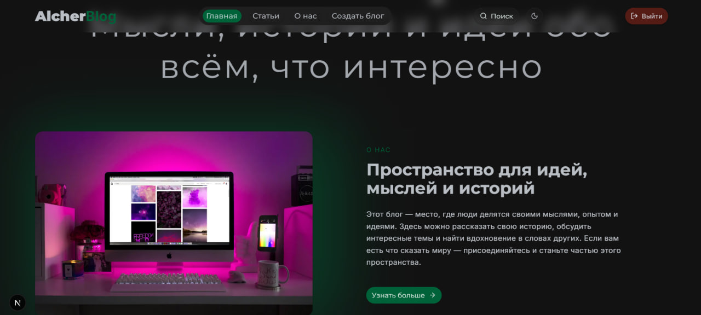
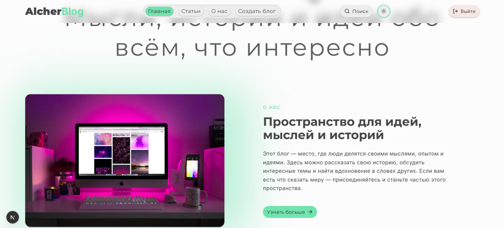
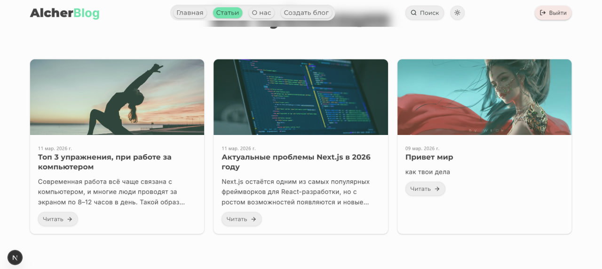
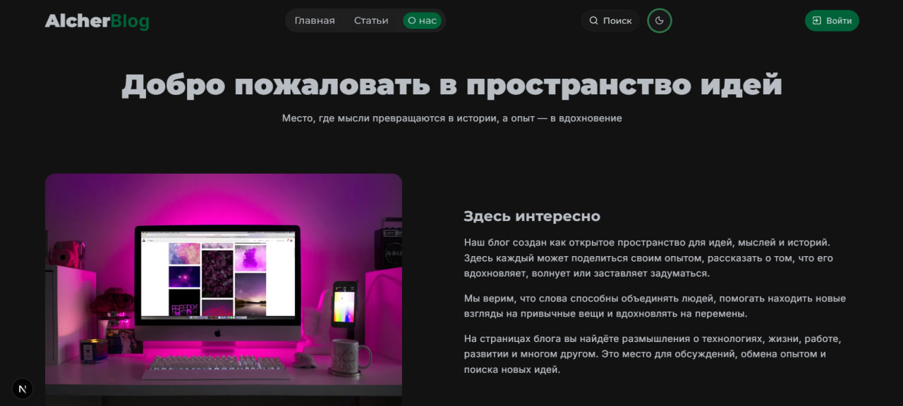

# A modern blog built with Next.js.

Where users can read articles, and after registering, create and manage their own posts.  
This project was created as a learning and portfolio project to practice full-stack development with a modern tech stack.    

## ✨ Opportunities

### For Guests  
- View published articles
- Open full article pages
- Theme toggle

### For Registered Users  
- Sign up and log in
- Create articles
- Edit their own articles
- Delete articles
- Upload images via Cloudinary


## 🚀 Tech Stack

| Category | Tools |
| -------- | ----- |
| Framework | Next.js (App Router) |
| Styling / UI | Tailwind CSS, shadcn, tweakcn |
| Database | PostgreSQL |
| ORM | Prisma |
| Auth | Better Auth |
| Data Fetching | React Query |
| Image Storage | Cloudinary |
| Editor | Jodit |
| State Management | Zustand |
| Language | TypeScript |

## 📸 Screenshots






## 🛠 Getting Started

To run this project locally, follow these steps:

1. **Clone the repository:**  

```bash
git clone https://github.com/Al-cher/alcher-blog.git
```

2. **Install dependencies:**
```bash
pnpm install

```
3. **Set up environment variables:**
```env
DATABASE_URL=data_base_url
BETTER_AUTH_SECRET=auth_secret
BASE_URL=base_url

GOOGLE_CLIENT_ID=client_id
GOOGLE_CLIENT_SECRET=client_secret

CLOUDINARY_CLOUD_NAME=cloud_name
CLOUDINARY_API_KEY=api_key
CLOUDINARY_API_SECRET=secret
```

4. **Run the development server:**
```bash
pnpm run dev
```

5. **Open in browser:**
Visit http://localhost:3000  to see the project running.

___Optional: If you use Prisma migrations, run:___
```bash
pnpm prisma migrate dev  
pnpm prisma generate
```

